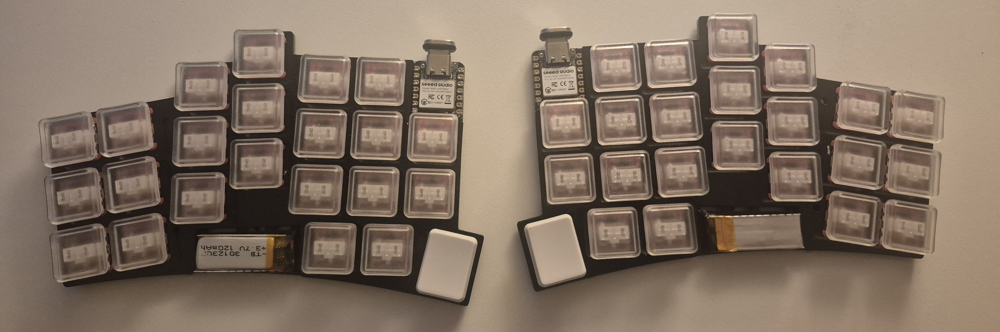
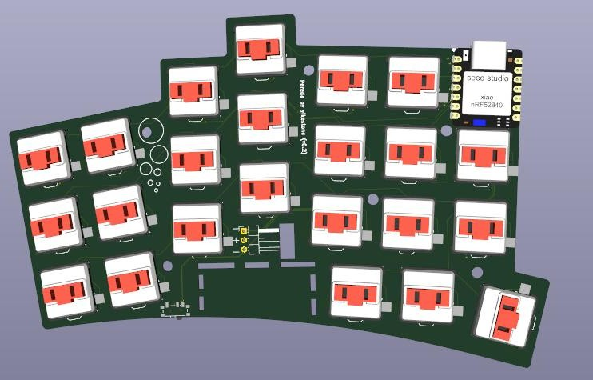
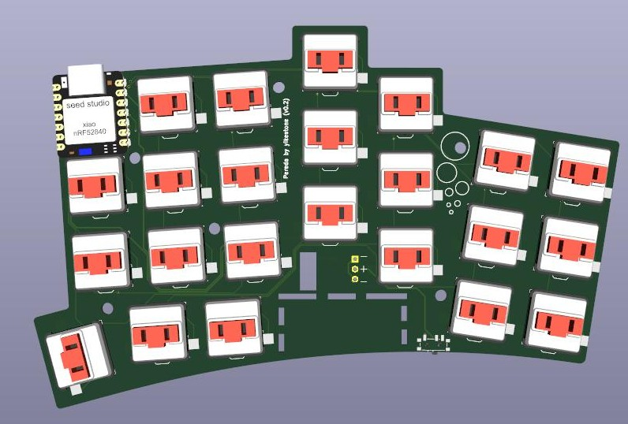

# Pereda

Pereda is a custom wireless mechanical keyboard designed for **Kailh Choc V1** switches.

It has **46 keys**, aggressive **column stagger**, and **column splay**. The key positions are designed around finger length and natural finger-joint movement rather than a conventional keyboard layout.

## Hardware

* Kailh Choc V1 switches
* Seeed Studio XIAO nRF52840
* Wireless
* 46 keys
* Aggressive column stagger and column splay
* Reversible PCB
* 301230 LiPo battery, 120 mAh
* Magnetic USB-C connector for charging
* Custom ergonomic key layout

## Build Details

* **Top plate:** 1 mm laser-cut aluminum, spray-painted black
* **PCB:** Black solder mask
* **Keyboard height:** ~1.5 cm from the table surface
* **Feet:** 8 × 3 mm silicone dots to prevent sliding

## Assembly

After soldering the XIAO nRF52840 module to the PCB, a battery pad on the underside of the XIAO remains accessible through the cutout in the PCB.

Solder the exposed battery pad on the XIAO to the corresponding battery pad on the PCB using a short wire.

The PCB is reversible, allowing the same PCB design to be used for either side.

## Firmware

Pereda uses **ZMK firmware**.

[Pereda ZMK Configuration](https://github.com/YikeStone/pereda-zmk)

## Manufacturing

Ready-to-manufacture files are available under:

`manufacturing/v0.2/`

The BOM quantities are for **one PCB/half**.

## Repository

* `common/` — custom symbols, footprints, and 3D models
* `images/` — project images
* `manufacturing/` — BOM, fabrication files, DXF, and CAD
* `*.kicad_*` — KiCad source files

## Status

**v0.2 — functional prototype.**

## Acknowledgements

Inspired by the [Corne keyboard](https://github.com/foostan/crkbd) by foostan.

## License

See `LICENSE`.

